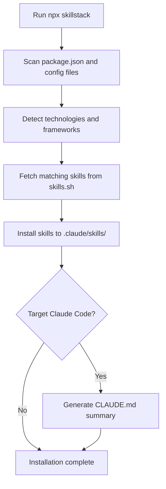

<div align="center">

# skillstack

**One command. Your entire AI skill stack. Installed.**

[](https://www.npmjs.com/package/skillstack)
[](https://creativecommons.org/licenses/by-nc/4.0/)
[](https://nodejs.org/)
[](https://www.typescriptlang.org/)

[skillstack.site](https://www.skillstack.site/) | [skills.sh](https://skills.sh) | [Documentation](https://skillstack.sh/docs)

<a href="https://skillstack.sh">

</a>

</div>

## Overview

`skillstack` is a sophisticated Node.js CLI tool built with TypeScript that automates the installation of AI agent skills tailored to your project's technology stack. It performs intelligent detection of frameworks, languages, and tools by analyzing configuration files, then fetches and installs the most relevant skills from the [skills.sh](https://skills.sh) registry.

The tool is designed for modern development workflows, supporting monorepos, multi-language projects, and continuous integration environments. It integrates seamlessly with AI assistants like Claude Code, Cursor, and GitHub Copilot.

## Architecture

### Core Components

- **Detector Engine**: Scans `package.json`, `build.gradle`, `Cargo.toml`, and other configuration files to identify technologies
- **Skills Registry**: Interfaces with skills.sh API to retrieve skill metadata and installation manifests
- **Installer**: Downloads and installs skills to `.claude/skills/` directory with conflict resolution
- **Summarizer**: Generates `CLAUDE.md` summaries for Claude Code integration

### Technology Detection

The detector uses pattern matching and dependency analysis to identify:

- **Frontend Frameworks**: React, Vue, Angular, Svelte, Astro
- **Backend Runtimes**: Node.js, Deno, Bun, Go, Python
- **Build Tools**: Vite, Turborepo, Webpack, Rollup
- **Cloud Platforms**: Vercel, AWS, Azure, Cloudflare
- **Testing Frameworks**: Vitest, Jest, Playwright
- **Database ORMs**: Prisma, Drizzle, TypeORM

## Installation Flow



## Installation

### Prerequisites

- Node.js >= 22.6.0
- npm or pnpm package manager

### Global Installation

```bash
npm install -g skillstack
skillstack --help
```

### One-time Usage

```bash
npx skillstack
```

## Usage

### Basic Command

```bash
npx skillstack
```

Scans the current directory and installs appropriate skills.

### Options

| Option | Description |
|--------|-------------|
| `-y, --yes` | Skip confirmation prompts |
| `--dry-run` | Preview changes without installing |
| `-a, --agent <name>` | Target specific AI agent (claude-code, cursor, copilot) |
| `-v, --verbose` | Enable verbose logging |
| `-h, --help` | Display help information |

### Examples

```bash
# Dry run to see what would be installed
npx skillstack --dry-run

# Install for Claude Code specifically
npx skillstack -a claude-code

# Skip confirmations in CI
npx skillstack --yes
```

### CLAUDE.md Generation

When targeting Claude Code, `skillstack` generates a `CLAUDE.md` file containing:

- Summary of installed skills
- Technology-specific guidance
- Integration instructions
- Best practices for the detected stack

## Supported Technologies

### Frontend & UI
- React, Next.js, Vue, Nuxt, Svelte, Angular
- Astro, Tailwind CSS, shadcn/ui, GSAP, Three.js

### Languages & Runtimes
- TypeScript, JavaScript, Go, Rust, Python
- Node.js, Bun, Deno, Dart

### Backend & APIs
- Express, Hono, NestJS, Spring Boot, FastAPI
- GraphQL, REST APIs, WebSockets

### Mobile & Desktop
- Expo, React Native, Flutter, SwiftUI
- Tauri, Electron, Kotlin Multiplatform

### Data & Storage
- Supabase, Neon, PlanetScale, Prisma, Drizzle ORM
- MongoDB, PostgreSQL, Redis, Zod validation

### Auth & Payments
- Better Auth, Clerk, Auth0, Stripe, Lemon Squeezy

### Testing & Quality
- Vitest, Jest, Playwright, Cypress
- ESLint, Prettier, oxlint, TypeScript

### Cloud & Infrastructure
- Vercel, Netlify, Cloudflare, AWS, Azure
- Terraform, Docker, Kubernetes, CI/CD

### Media & AI
- Remotion, ElevenLabs, OpenAI, Anthropic
- WebRTC, WebGL, Canvas APIs

## Development

### Project Structure

```
skillstack/
├── packages/
│   ├── skillstack/          # Main CLI package
│   │   ├── index.mjs        # Entry point
│   │   ├── lib.ts           # Core logic
│   │   ├── installer.ts     # Skill installation
│   │   ├── claude.ts        # CLAUDE.md generation
│   │   ├── colors.ts        # Terminal colors
│   │   └── tests/           # Unit tests
│   └── autoskills/          # Auto-detection logic
├── src/                     # Astro website
├── scripts/                 # Build and release scripts
└── assets/                  # Static assets
```

### Setup

```bash
# Clone repository
git clone https://github.com/cookie-may/skillstack.git
cd skillstack

# Install dependencies
pnpm install

# Build CLI
cd packages/skillstack
pnpm build

# Run tests
pnpm test
```

### Build Process

The project uses a monorepo structure with pnpm workspaces:

```bash
# Build all packages
pnpm build

# Build website
pnpm dev

# Lint and format
pnpm lint
pnpm fmt
```

### Testing

Tests are written using Node.js built-in test runner:

```bash
# Run all tests
pnpm test

# Run specific test
node --test tests/detect.test.ts

# Benchmark performance
pnpm bench
```

## API Reference

### Programmatic Usage

```typescript
import { detectSkills, installSkills } from 'skillstack';

const technologies = await detectSkills('./');
const skills = await installSkills(technologies, {
  target: 'claude-code',
  dryRun: false
});
```

### Configuration

Skills can be customized via `.skillstackrc.json`:

```json
{
  "exclude": ["experimental-skill"],
  "include": ["custom-skill"],
  "target": "claude-code"
}
```

## Contributing

We welcome contributions! Please see our [Contributing Guide](CONTRIBUTING.md) for details.

### Development Workflow

1. Fork the repository
2. Create a feature branch
3. Make changes with tests
4. Run `pnpm test` and `pnpm lint`
5. Submit a pull request

### Adding New Skills

Skills are defined in the [skills.sh registry](https://skills.sh). To add a new skill:

1. Create a skill definition JSON
2. Test detection patterns
3. Submit to skills.sh repository

## Security

This project follows security best practices:

- Dependencies are pinned with exact versions
- No installation scripts in dependencies
- Regular security audits via npm audit
- Supply chain protection via [fendo](https://github.com/midudev/fendo)

## Performance

- **Detection**: < 100ms for typical projects
- **Installation**: < 5 seconds for skill bundles
- **Memory**: < 50MB peak usage
- **Network**: Minimal API calls with caching

## Troubleshooting

### Common Issues

**Detection fails**
- Ensure `package.json` exists and contains dependencies
- Check file permissions
- Run with `--verbose` for debug info

**Installation errors**
- Verify internet connection
- Check `.claude/skills/` permissions
- Clear npm/pnpm cache

**CLAUDE.md not generated**
- Ensure `-a claude-code` flag is used
- Check write permissions in project root

### Debug Mode

```bash
DEBUG=skillstack:* npx skillstack --verbose
```

## License

[CC BY-NC 4.0](./LICENSE) — Created by [midudev](https://midu.dev)

## Acknowledgments

- [skills.sh](https://skills.sh) for the skill registry
- [Claude Code](https://claude.ai/code) for AI assistant integration
- [fendo](https://github.com/midudev/fendo) for supply chain security
